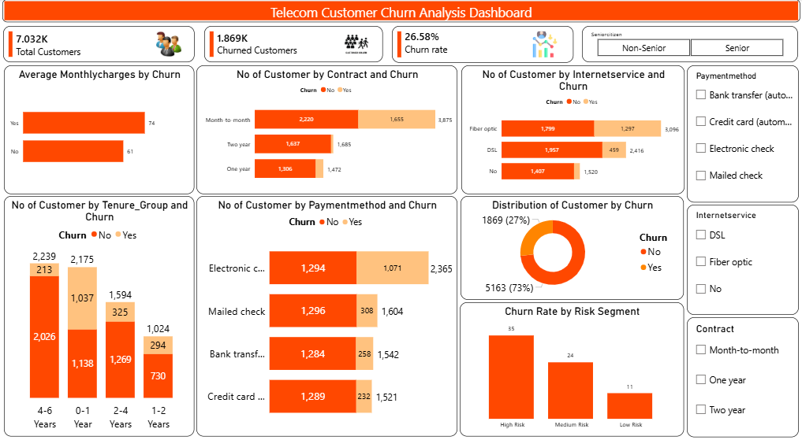

# Telecom Customer Churn Analysis Project

## Project Overview

The Telecom Customer Churn Analysis Project focuses on identifying the key factors influencing customer attrition in a telecommunications company. The project involves data preparation in Excel, data cleaning and exploratory data analysis (EDA) in Python, business analysis in SQL Server, and dashboard development in Power BI.

The goal is to understand customer behavior, identify churn drivers, and provide actionable recommendations to improve customer retention.

## Project Objective

- Analyze customer churn behavior.
- Identify factors affecting customer retention.
- Clean and transform raw customer data.
- Perform exploratory data analysis (EDA).
- Conduct business analysis using SQL Server.
- Develop an interactive Power BI dashboard.
- Generate business insights and recommendations.

## Tools Used

- Excel
- Python (Pandas, NumPy, Matplotlib, Seaborn)
- SQL Server
- Power BI

## Project Structure

```
telecom_customer_churn_analysis/
├── dataset/
│   ├── telecom_customer_churn_raw.csv
│   ├── telecom_customer_churn_excel_cleaned.csv
│   └── telecom_customer_churn_cleaned.xls
├── notebooks/
│   └── telecom_customer_churn_analysis.ipynb
├── sql/
│   └── telecom_customer_churn_analysis.sql
├── dashboard/
│   └── telecom_customer_churn_analysis_dashboard.pbix
├── screenshots/
│   └── dashboard_preview.png
└── README.md
```
## Dataset Information

Dataset Size: 7,032 records | 22 columns

### Features

- CustomerID
- Gender
- SeniorCitizen
- Partner
- Dependents
- Tenure
- PhoneService
- MultipleLines
- InternetService
- OnlineSecurity
- OnlineBackup
- DeviceProtection
- TechSupport
- StreamingTV
- StreamingMovies
- Contract
- PaperlessBilling
- PaymentMethod
- MonthlyCharges
- TotalCharges
- Churn
- Tenure_Group (engineered feature)

## Project Workflow

### 1. Data Preparation (Excel)

- Downloaded the raw dataset.
- Opened the dataset in Excel.
- Used Data → Text to Columns to separate values correctly.
- Verified the dataset structure.
- Saved the dataset in CSV format.

### 2. Data Cleaning & EDA (Python)

- Imported dataset into Python.
- Checked data structure and data types.
- Removed duplicate records.
- Converted TotalCharges to numeric format and handled blank values for zero-tenure customers.
- Handled missing values.
- Created Tenure_Group feature.
- Performed Exploratory Data Analysis (EDA).
- Generated visualizations and business insights.

### 3. SQL Analysis (SQL Server)

- Imported the cleaned dataset into SQL Server.
- Used Aggregate Functions.
- Performed GROUP BY analysis.
- Applied CASE statements for customer risk segmentation.
- Generated business insights.

### 4. Dashboard Development (Power BI)

- Created KPI Cards.
- Built interactive visualizations.
- Added slicers and filters.
- Developed a customer churn dashboard.

## SQL Business Questions Solved

1. Total churned customers
2. Overall churn rate
3. Churn by gender
4. Churn by contract type
5. Churn by payment method
6. Churn by internet service
7. Churn by tenure group
8. Average monthly charges by churn
9. Average total charges by churn
10. Customer risk segmentation
11. Top 10 highest paying customers
12. Churn Rate by Risk Segment

## Dashboard Preview



### KPI Cards
- Total Customers
- Churned Customers
- Churn Rate

### Charts
- Average Monthly Charges by Churn (Bar Chart)
- Customers by Contract and Churn (Clustered Bar Chart)
- Customers by Internet Service and Churn (Clustered Bar Chart)
- Customers by Tenure Group and Churn (Clustered Column Chart)
- Customers by Payment Method and Churn (Clustered Bar Chart)
- Distribution of Customers by Churn (Donut Chart)
- Churn Rate by Risk Segment (Column Chart)

### Filters/Slicers
- Senior Citizen
- Payment Method
- Internet Service
- Contract

## Key Business Insights

1. Approximately 26.58% of customers have churned, while 73.42% have been retained.
2. Gender has minimal impact on customer churn.
3. Month-to-Month contract customers exhibit the highest churn rate.
4. Electronic Check users have the highest churn rate.
5. Fiber Optic customers experience significantly higher churn.
6. Customer churn decreases as tenure increases.
7. Customers who churn have higher average monthly charges.
8. Churned customers have lower average total charges.
9. Long-term contracts significantly improve retention.
10. High-risk customers (by monthly charge segment) churn at 35%, over 3x the rate of low-risk customers (11%).

## Business Recommendations

- Encourage customers to switch to long-term contracts.
- Offer loyalty rewards for long-tenure customers.
- Improve customer experience for Fiber Optic users.
- Promote automatic payment methods.
- Provide personalized retention offers to high-risk customers.
- Focus retention campaigns on new customers.

## How to Reproduce

1. Clone this repository
2. Run notebooks/telecom_customer_churn_analysis.ipynb to generate the cleaned dataset
3. Load telecom_customer_churn_cleaned.csv into SQL Server, run sql/telecom_customer_churn_analysis.sql
4. Open dashboard/telecom_customer_churn_analysis_dashboard.pbix in Power BI Desktop

## Conclusion

This project successfully identified the primary factors contributing to customer churn. Contract type, payment method, internet service, tenure, and monthly charges were found to be the most influential variables affecting customer attrition.

## Author

Sushil Kumar | Aspiring Data Analyst | Skills: Excel, Python, SQL Server, Power BI